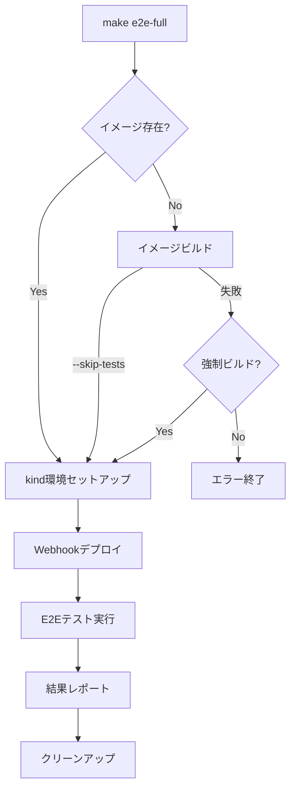
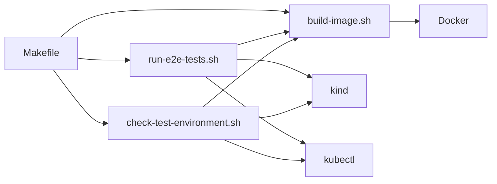

# デザインドキュメント

## 概要

このドキュメントでは、Kubernetes HPA/Deployment Validatorのエンドツーエンド（E2E）テスト環境の改善に関するデザインを定義します。現在、テスト実行時に「卵が先か鶏が先か」の問題が発生しており、テストを実行するにはDockerイメージが必要ですが、イメージをビルドするにはテストが通る必要があるという循環的な依存関係があります。この問題を解決し、より堅牢なテスト環境を構築するためのデザインを提案します。

## アーキテクチャ

### 現在の問題点

現在のテスト実行フローには以下の問題があります：

1. `make e2e-full` を実行すると、Dockerイメージ 'hpa-validator:latest' が必要
2. イメージをビルドするために `./scripts/build-image.sh` を実行すると、テストが実行される
3. テスト（特に `test/monitoring/monitoring_test.go`）が失敗すると、イメージビルドが中止される
4. 結果として、テストを実行するためのイメージが作成できないという循環的な問題が発生

### 改善アーキテクチャ

以下の改善を行います：

1. **ビルドプロセスの分離**
   - テスト実行とイメージビルドを分離
   - イメージビルド時にテスト失敗を許容するオプションを追加

2. **自動イメージビルド機能**
   - `make e2e-full` 実行時にイメージが存在しない場合、自動的にビルドを試行

3. **テスト環境状態管理**
   - テスト環境のセットアップ状態を明確に表示
   - 問題発生時の具体的なエラーメッセージと解決策を提供

4. **CI/CD環境の柔軟な設定**
   - 環境変数によるテスト動作のカスタマイズ
   - 特定のテストカテゴリをスキップするオプション

## コンポーネントとインターフェース

### 1. ビルドスクリプト（`scripts/build-image.sh`）

**改善点**：
- テストをスキップするオプション（`--skip-tests`）を追加
- テスト失敗時でもビルドを続行するオプション（`--force-build`）を追加
- 詳細なエラーメッセージとデバッグ情報の提供

**インターフェース**：
```bash
./scripts/build-image.sh [--skip-tests] [--force-build] [--help]
```

### 2. E2Eテスト実行スクリプト（`scripts/run-e2e-tests.sh`）

**改善点**：
- イメージ存在チェックと自動ビルド機能の追加
- テスト環境のセットアップ状態の詳細表示
- 特定のテストカテゴリをスキップするオプションの追加

**インターフェース**：
```bash
./scripts/run-e2e-tests.sh [--skip-setup] [--no-cleanup] [--full-cleanup] [--auto-build] [--skip-category=CATEGORY] [--help]
```

### 3. Makefile

**改善点**：
- 新しいターゲットの追加（`build-image-only`, `build-image-force`）
- E2Eテスト実行時の自動イメージビルドオプション（`e2e-full-auto`）

**インターフェース**：
```makefile
make build-image-only      # テストをスキップしてイメージのみビルド
make build-image-force     # テスト失敗時でも強制的にイメージをビルド
make e2e-full-auto         # 必要に応じて自動的にイメージをビルドしてE2Eテストを実行
```

### 4. テスト環境状態チェッカー（新規）

**機能**：
- テスト環境の状態を確認（イメージの有無、クラスタの状態など）
- 問題がある場合は具体的な解決策を提案

**インターフェース**：
```bash
./scripts/check-test-environment.sh [--verbose] [--fix] [--help]
```

## データモデル

### 環境設定

テスト環境の設定を制御するための環境変数：

```bash
# テスト実行制御
SKIP_TESTS=true|false           # テストをスキップするかどうか
FORCE_BUILD=true|false          # テスト失敗時でもビルドを強制するかどうか
AUTO_BUILD=true|false           # イメージが存在しない場合に自動ビルドするかどうか

# テストカテゴリ制御
SKIP_CATEGORIES=monitoring,performance  # スキップするテストカテゴリ

# リソース制約
LOW_RESOURCE_MODE=true|false    # 最小限のリソースでテストを実行するかどうか
```

### テスト状態

テスト環境の状態を表すデータ構造：

```json
{
  "image": {
    "exists": true|false,
    "tag": "latest",
    "size": "123MB",
    "created": "2025-07-18T12:34:56Z"
  },
  "cluster": {
    "exists": true|false,
    "name": "hpa-validator",
    "status": "running|stopped|error",
    "nodes": 1
  },
  "webhook": {
    "deployed": true|false,
    "status": "running|error",
    "pods": 1,
    "ready": true|false
  }
}
```

## エラーハンドリング

### エラーカテゴリ

1. **イメージビルドエラー**
   - テスト失敗によるビルド中止
   - Dockerデーモン接続エラー
   - ビルドプロセスエラー

2. **クラスタセットアップエラー**
   - kind クラスタ作成失敗
   - リソース不足エラー
   - ネットワークエラー

3. **Webhookデプロイエラー**
   - 証明書生成エラー
   - Kubernetes APIエラー
   - リソース競合エラー

### エラー対応戦略

1. **自動リカバリ**
   - 一時的なエラーの場合、自動的に再試行
   - 既存リソースのクリーンアップと再作成

2. **詳細なエラーメッセージ**
   - エラーの原因と影響範囲を明確に表示
   - 具体的な解決策の提案

3. **段階的なフォールバック**
   - 完全なテストが失敗した場合、部分的なテストを試行
   - 最小限の機能テストを実行

## テスト戦略

### テストカテゴリ

1. **ユニットテスト**
   - 個々のコンポーネントの機能テスト
   - イメージビルドに必須

2. **統合テスト**
   - コンポーネント間の連携テスト
   - イメージビルドに必須

3. **監視テスト**
   - メトリクスエンドポイントのテスト
   - イメージビルドに必須ではない（スキップ可能）

4. **E2Eテスト**
   - 完全なシステムテスト
   - イメージが必要

### テスト分離戦略

1. **必須テストと任意テストの分離**
   - イメージビルドに必須のテストと任意のテストを分離
   - ビルドタグによるテスト制御（例：`// +build !skipbuild`）

2. **テスト依存関係の最小化**
   - モックとスタブの活用
   - 外部依存の最小化

3. **テスト環境の独立性確保**
   - テスト間の干渉を防止
   - クリーンな環境での実行

## 図表

### 改善後のテスト実行フロー



### コンポーネント間の関係



## 設計上の決定と根拠

1. **テストスキップオプションの追加**
   - 根拠：イメージビルドとテスト実行の循環依存を解消するため
   - トレードオフ：テストスキップによる品質リスクと開発効率のバランス

2. **自動イメージビルド機能**
   - 根拠：ユーザー体験の向上と手順の簡略化
   - トレードオフ：自動化による透明性の低下と制御の喪失

3. **環境変数によるカスタマイズ**
   - 根拠：CI/CD環境での柔軟な設定を可能にするため
   - トレードオフ：設定の複雑化と管理の難しさ

4. **テスト環境状態チェッカーの導入**
   - 根拠：問題の早期発見と解決を支援するため
   - トレードオフ：追加のコンポーネントによる複雑性の増加