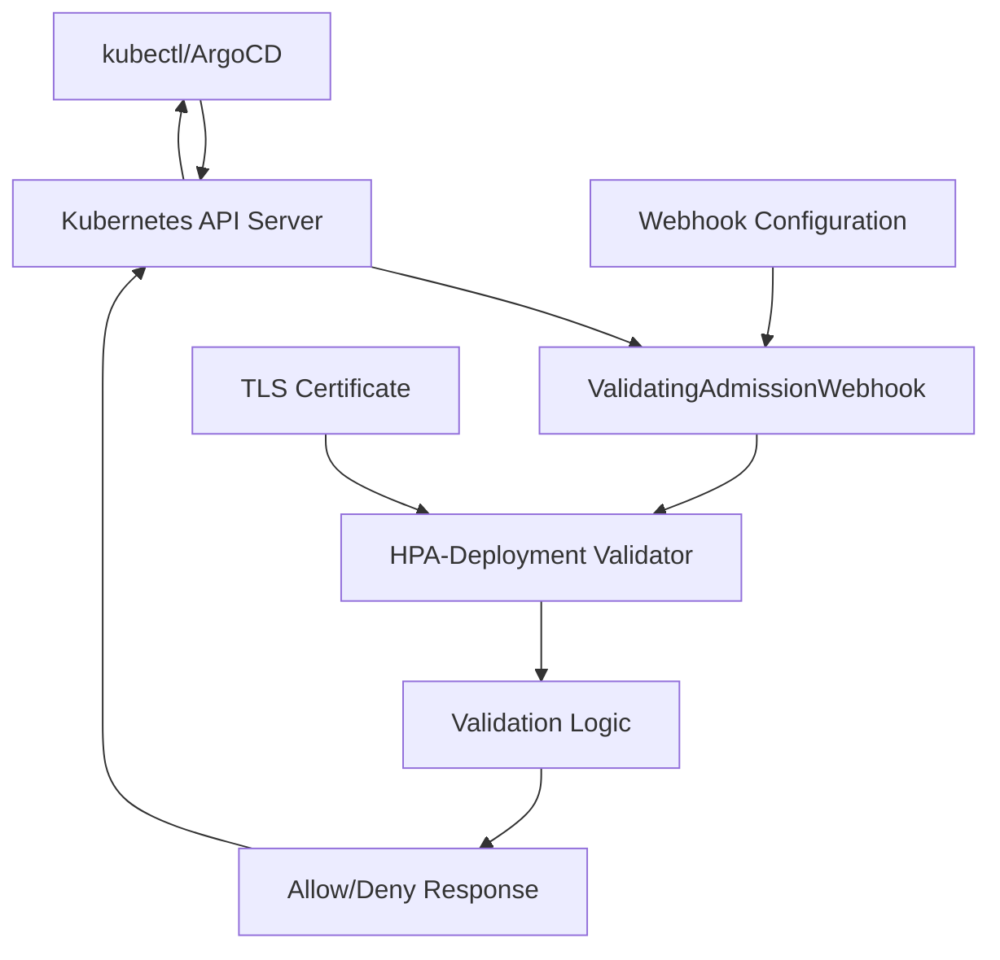

# 設計書

## 概要

1 replicaのDeploymentにHPAが紐づくことを防ぐValidatingAdmissionWebhookを実装する。Goを使用してWebhookサーバーを構築し、kind環境でのデプロイメントとテストを可能にする。

## アーキテクチャ

### 全体構成



### コンポーネント設計

1. **Webhook Server**: HTTPSサーバーとしてバリデーション要求を受信
2. **Validation Engine**: DeploymentとHPAの関係性をチェック
3. **Certificate Manager**: TLS証明書の管理
4. **Configuration**: Webhookの設定とポリシー

## コンポーネントと インターフェース

### Webhook Server

```go
type WebhookServer struct {
    server *http.Server
    client kubernetes.Interface
}

type ValidationRequest struct {
    AdmissionRequest *admissionv1.AdmissionRequest
}

type ValidationResponse struct {
    AdmissionResponse *admissionv1.AdmissionResponse
}
```

### Validation Engine

```go
type Validator interface {
    ValidateDeployment(ctx context.Context, deployment *appsv1.Deployment) error
    ValidateHPA(ctx context.Context, hpa *autoscalingv2.HorizontalPodAutoscaler) error
}

type DeploymentHPAValidator struct {
    client kubernetes.Interface
}
```

### バリデーションロジック

1. **Deploymentバリデーション**:
   - Deploymentのreplicas == 1かチェック
   - 同じnamespaceでscaleTargetRefが該当DeploymentのHPAを検索
   - 存在する場合はエラー

2. **HPAバリデーション**:
   - HPAのscaleTargetRefからDeploymentを取得
   - Deploymentのreplicas == 1かチェック
   - 該当する場合はエラー

## データモデル

### 入力データ

```go
// Deployment検証用
type DeploymentValidationData struct {
    Deployment *appsv1.Deployment
    Namespace  string
    Operation  string // CREATE, UPDATE
}

// HPA検証用
type HPAValidationData struct {
    HPA       *autoscalingv2.HorizontalPodAutoscaler
    Namespace string
    Operation string // CREATE, UPDATE
}
```

### 出力データ

```go
type ValidationResult struct {
    Allowed bool
    Message string
    Code    int32
}
```

## エラーハンドリング

### エラーカテゴリ

1. **バリデーションエラー**: 1 replica + HPA の組み合わせ
2. **システムエラー**: Kubernetes API呼び出し失敗
3. **設定エラー**: Webhook設定の問題

### エラーメッセージ（日本語）

```go
const (
    ErrDeploymentWithHPA = "1 replicaのDeploymentにHPAが設定されています。HPAを削除するか、replicasを2以上に設定してください。"
    ErrHPAWithSingleReplica = "1 replicaのDeploymentを対象とするHPAは作成できません。Deploymentのreplicasを2以上に設定してください。"
    ErrSystemFailure = "システムエラーが発生しました。管理者に連絡してください。"
)
```

## テスト戦略

### 単体テスト

1. バリデーション関数のテスト
2. Webhook ハンドラーのテスト
3. エラーケースのテスト

### 統合テスト

1. kind環境でのE2Eテスト
2. ArgoCDシミュレーションテスト
3. 同時デプロイメントテスト

### テストケース

```go
type TestCase struct {
    Name           string
    Deployment     *appsv1.Deployment
    HPA           *autoscalingv2.HorizontalPodAutoscaler
    ExpectedResult bool
    ExpectedError  string
}
```

## セキュリティ考慮事項

1. **TLS通信**: Webhook通信の暗号化
2. **RBAC**: 最小権限の原則
3. **証明書管理**: 自動更新機能

## パフォーマンス考慮事項

1. **キャッシュ**: Kubernetes APIクライアントのキャッシュ活用
2. **タイムアウト**: 適切なタイムアウト設定
3. **リソース制限**: CPU/メモリ制限の設定

## デプロイメント設計

### Kubernetes マニフェスト

1. **Deployment**: Webhookサーバーのデプロイ
2. **Service**: Webhookエンドポイントの公開
3. **ValidatingAdmissionWebhook**: Webhook設定
4. **RBAC**: 必要な権限の設定
5. **Secret**: TLS証明書の管理

### 設定オプション

```yaml
apiVersion: v1
kind: ConfigMap
metadata:
  name: hpa-validator-config
data:
  enable-validation: "true"
  log-level: "info"
  webhook-port: "8443"
```

## 運用考慮事項

1. **ログ**: 構造化ログの出力
2. **メトリクス**: Prometheusメトリクスの提供
3. **ヘルスチェック**: liveness/readiness probe
4. **アップグレード**: ローリングアップデート対応