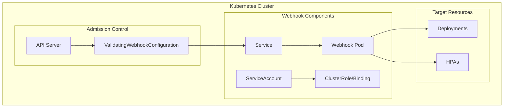
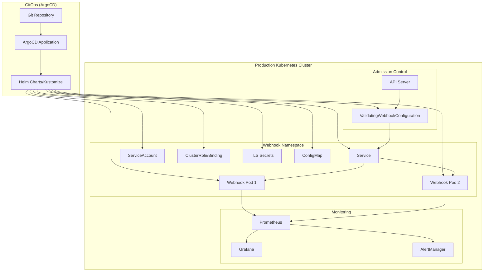

# 設計書

## 概要

既存のKubernetes validating admission webhookを本番環境で運用するための設計を行う。主要な改善点として、ArgoCDとの統合、設定の変数化、本番用マニフェストの最適化、運用ドキュメントの整備を実施する。

## アーキテクチャ

### 現在のアーキテクチャ



### 本番環境対応アーキテクチャ



## コンポーネントと インターフェース

### 1. ArgoCD統合コンポーネント

#### 1.1 Application定義
```yaml
# argocd/application.yaml
apiVersion: argoproj.io/v1alpha1
kind: Application
metadata:
  name: k8s-deployment-hpa-validator
  namespace: argocd
spec:
  project: default
  source:
    repoURL: <repository-url>
    targetRevision: HEAD
    path: manifests/production
  destination:
    server: https://kubernetes.default.svc
    namespace: webhook-system
  syncPolicy:
    automated:
      prune: true
      selfHeal: true
    syncOptions:
    - CreateNamespace=true
```

#### 1.2 Kustomization構造
```
manifests/
├── base/                    # 基本マニフェスト
│   ├── deployment.yaml
│   ├── service.yaml
│   ├── rbac.yaml
│   ├── webhook.yaml
│   └── kustomization.yaml
├── overlays/
│   ├── development/         # 開発環境用
│   │   ├── kustomization.yaml
│   │   └── patches/
│   ├── staging/            # ステージング環境用
│   │   ├── kustomization.yaml
│   │   └── patches/
│   └── production/         # 本番環境用
│       ├── kustomization.yaml
│       ├── patches/
│       └── secrets/
└── argocd/                 # ArgoCD設定
    └── application.yaml
```

### 2. 設定管理コンポーネント

#### 2.1 ConfigMap設計
```yaml
apiVersion: v1
kind: ConfigMap
metadata:
  name: webhook-config
data:
  # Webhook設定
  webhook.port: "8443"
  webhook.timeout: "10"
  webhook.failure-policy: "Fail"
  
  # ログ設定
  log.level: "info"
  log.format: "json"
  
  # バリデーション設定
  validation.skip-namespaces: "kube-system,kube-public,kube-node-lease"
  validation.skip-labels: "k8s-deployment-hpa-validator.io/skip-validation=true"
  
  # 監視設定
  metrics.enabled: "true"
  metrics.port: "8080"
  health.enabled: "true"
```

#### 2.2 環境変数設計
```yaml
env:
# 必須設定
- name: WEBHOOK_PORT
  valueFrom:
    configMapKeyRef:
      name: webhook-config
      key: webhook.port
- name: TLS_CERT_FILE
  value: "/etc/certs/tls.crt"
- name: TLS_KEY_FILE
  value: "/etc/certs/tls.key"

# 環境固有設定
- name: LOG_LEVEL
  valueFrom:
    configMapKeyRef:
      name: webhook-config
      key: log.level
- name: ENVIRONMENT
  value: "production"
- name: CLUSTER_NAME
  value: "prod-cluster-01"

# リソース制限
- name: GOMAXPROCS
  valueFrom:
    resourceFieldRef:
      resource: limits.cpu
```

### 3. セキュリティ強化コンポーネント

#### 3.1 証明書管理
```yaml
# cert-manager統合
apiVersion: cert-manager.io/v1
kind: Certificate
metadata:
  name: webhook-tls
spec:
  secretName: webhook-tls-secret
  issuerRef:
    name: ca-issuer
    kind: ClusterIssuer
  dnsNames:
  - k8s-deployment-hpa-validator.webhook-system.svc
  - k8s-deployment-hpa-validator.webhook-system.svc.cluster.local
```

#### 3.2 NetworkPolicy
```yaml
apiVersion: networking.k8s.io/v1
kind: NetworkPolicy
metadata:
  name: webhook-network-policy
spec:
  podSelector:
    matchLabels:
      app: k8s-deployment-hpa-validator
  policyTypes:
  - Ingress
  - Egress
  ingress:
  - from:
    - namespaceSelector:
        matchLabels:
          name: kube-system
    ports:
    - protocol: TCP
      port: 8443
  egress:
  - to: []
    ports:
    - protocol: TCP
      port: 443  # Kubernetes API
    - protocol: TCP
      port: 53   # DNS
    - protocol: UDP
      port: 53   # DNS
```

#### 3.3 PodSecurityPolicy/SecurityContext
```yaml
securityContext:
  runAsNonRoot: true
  runAsUser: 65534
  runAsGroup: 65534
  fsGroup: 65534
  seccompProfile:
    type: RuntimeDefault
  
containers:
- name: webhook
  securityContext:
    allowPrivilegeEscalation: false
    capabilities:
      drop:
      - ALL
    readOnlyRootFilesystem: true
    runAsNonRoot: true
    runAsUser: 65534
    runAsGroup: 65534
```

### 4. 監視・ログ出力コンポーネント

#### 4.1 メトリクス設計
```go
// 追加するメトリクス
var (
    webhookRequestsTotal = prometheus.NewCounterVec(
        prometheus.CounterOpts{
            Name: "webhook_requests_total",
            Help: "Total number of webhook requests",
        },
        []string{"method", "status", "resource_type"},
    )
    
    webhookRequestDuration = prometheus.NewHistogramVec(
        prometheus.HistogramOpts{
            Name: "webhook_request_duration_seconds",
            Help: "Duration of webhook requests",
            Buckets: prometheus.DefBuckets,
        },
        []string{"method", "resource_type"},
    )
    
    webhookValidationErrors = prometheus.NewCounterVec(
        prometheus.CounterOpts{
            Name: "webhook_validation_errors_total",
            Help: "Total number of validation errors",
        },
        []string{"error_type", "resource_type"},
    )
)
```

#### 4.2 構造化ログ設計
```go
// ログ構造
type LogEntry struct {
    Timestamp   time.Time `json:"timestamp"`
    Level       string    `json:"level"`
    Message     string    `json:"message"`
    Component   string    `json:"component"`
    RequestID   string    `json:"request_id,omitempty"`
    Resource    string    `json:"resource,omitempty"`
    Namespace   string    `json:"namespace,omitempty"`
    Action      string    `json:"action,omitempty"`
    Duration    string    `json:"duration,omitempty"`
    Error       string    `json:"error,omitempty"`
}
```

#### 4.3 ServiceMonitor設定
```yaml
apiVersion: monitoring.coreos.com/v1
kind: ServiceMonitor
metadata:
  name: webhook-metrics
spec:
  selector:
    matchLabels:
      app: k8s-deployment-hpa-validator
      component: metrics
  endpoints:
  - port: metrics
    interval: 30s
    path: /metrics
```

## データモデル

### 1. 設定データモデル

```go
// WebhookConfig 設定構造体
type WebhookConfig struct {
    // サーバー設定
    Port        int           `yaml:"port" env:"WEBHOOK_PORT" default:"8443"`
    TLSCertFile string        `yaml:"tls_cert_file" env:"TLS_CERT_FILE" default:"/etc/certs/tls.crt"`
    TLSKeyFile  string        `yaml:"tls_key_file" env:"TLS_KEY_FILE" default:"/etc/certs/tls.key"`
    Timeout     time.Duration `yaml:"timeout" env:"WEBHOOK_TIMEOUT" default:"10s"`
    
    // ログ設定
    LogLevel  string `yaml:"log_level" env:"LOG_LEVEL" default:"info"`
    LogFormat string `yaml:"log_format" env:"LOG_FORMAT" default:"json"`
    
    // バリデーション設定
    SkipNamespaces []string `yaml:"skip_namespaces" env:"SKIP_NAMESPACES"`
    SkipLabels     []string `yaml:"skip_labels" env:"SKIP_LABELS"`
    
    // 監視設定
    MetricsEnabled bool `yaml:"metrics_enabled" env:"METRICS_ENABLED" default:"true"`
    MetricsPort    int  `yaml:"metrics_port" env:"METRICS_PORT" default:"8080"`
    HealthEnabled  bool `yaml:"health_enabled" env:"HEALTH_ENABLED" default:"true"`
    
    // 環境情報
    Environment string `yaml:"environment" env:"ENVIRONMENT" default:"development"`
    ClusterName string `yaml:"cluster_name" env:"CLUSTER_NAME"`
}
```

### 2. 環境別設定モデル

```yaml
# 開発環境
development:
  replicas: 1
  resources:
    requests:
      cpu: 50m
      memory: 64Mi
    limits:
      cpu: 200m
      memory: 128Mi
  log_level: debug
  failure_policy: Ignore

# ステージング環境
staging:
  replicas: 2
  resources:
    requests:
      cpu: 100m
      memory: 128Mi
    limits:
      cpu: 500m
      memory: 256Mi
  log_level: info
  failure_policy: Fail

# 本番環境
production:
  replicas: 3
  resources:
    requests:
      cpu: 200m
      memory: 256Mi
    limits:
      cpu: 1000m
      memory: 512Mi
  log_level: warn
  failure_policy: Fail
```

## エラーハンドリング

### 1. エラー分類と対応

```go
// エラータイプ定義
type ErrorType string

const (
    ErrorTypeValidation    ErrorType = "validation"
    ErrorTypeConfiguration ErrorType = "configuration"
    ErrorTypeNetwork       ErrorType = "network"
    ErrorTypeCertificate   ErrorType = "certificate"
    ErrorTypeInternal      ErrorType = "internal"
)

// エラー構造体
type WebhookError struct {
    Type        ErrorType `json:"type"`
    Code        string    `json:"code"`
    Message     string    `json:"message"`
    Details     string    `json:"details,omitempty"`
    Suggestions []string  `json:"suggestions,omitempty"`
    Timestamp   time.Time `json:"timestamp"`
}
```

### 2. 本番環境エラー対応

```go
// 本番環境用エラーハンドラー
func (w *WebhookServer) handleProductionError(err error, req *admission.Request) *admission.Response {
    webhookError := classifyError(err)
    
    // メトリクス記録
    webhookValidationErrors.WithLabelValues(
        string(webhookError.Type),
        req.Kind.Kind,
    ).Inc()
    
    // 構造化ログ出力
    w.logger.Error("webhook error occurred",
        "error_type", webhookError.Type,
        "error_code", webhookError.Code,
        "resource", req.Kind.Kind,
        "namespace", req.Namespace,
        "name", req.Name,
        "error", err.Error(),
    )
    
    // 本番環境では詳細なエラー情報を制限
    if w.config.Environment == "production" {
        return &admission.Response{
            UID:     req.UID,
            Allowed: false,
            Result: &metav1.Status{
                Code:    http.StatusBadRequest,
                Message: webhookError.Message,
            },
        }
    }
    
    // 開発環境では詳細情報を含める
    return &admission.Response{
        UID:     req.UID,
        Allowed: false,
        Result: &metav1.Status{
            Code:    http.StatusBadRequest,
            Message: fmt.Sprintf("%s: %s", webhookError.Message, webhookError.Details),
        },
    }
}
```

### 3. 回復可能エラーの処理

```go
// 回復可能エラーの再試行ロジック
func (w *WebhookServer) validateWithRetry(ctx context.Context, req *admission.Request) (*admission.Response, error) {
    const maxRetries = 3
    const baseDelay = 100 * time.Millisecond
    
    for attempt := 0; attempt < maxRetries; attempt++ {
        resp, err := w.validate(ctx, req)
        if err == nil {
            return resp, nil
        }
        
        // 回復不可能なエラーは即座に返す
        if !isRetryableError(err) {
            return nil, err
        }
        
        // 指数バックオフで再試行
        if attempt < maxRetries-1 {
            delay := baseDelay * time.Duration(1<<attempt)
            time.Sleep(delay)
        }
    }
    
    return nil, fmt.Errorf("validation failed after %d attempts", maxRetries)
}
```

## テスト戦略

### 1. 本番環境テスト

#### 1.1 統合テスト拡張
```go
// 本番環境設定でのテスト
func TestProductionConfiguration(t *testing.T) {
    config := &WebhookConfig{
        Environment:   "production",
        LogLevel:     "warn",
        FailurePolicy: "Fail",
        Replicas:     3,
    }
    
    server := NewWebhookServer(config)
    
    // 本番環境固有のテストケース
    testCases := []struct {
        name     string
        request  *admission.Request
        expected bool
    }{
        // テストケース定義
    }
    
    for _, tc := range testCases {
        t.Run(tc.name, func(t *testing.T) {
            // テスト実行
        })
    }
}
```

#### 1.2 負荷テスト
```go
// 負荷テスト
func TestWebhookPerformance(t *testing.T) {
    const (
        concurrency = 100
        requests    = 1000
    )
    
    server := setupTestServer(t)
    defer server.Close()
    
    var wg sync.WaitGroup
    results := make(chan time.Duration, requests)
    
    for i := 0; i < concurrency; i++ {
        wg.Add(1)
        go func() {
            defer wg.Done()
            for j := 0; j < requests/concurrency; j++ {
                start := time.Now()
                // リクエスト実行
                duration := time.Since(start)
                results <- duration
            }
        }()
    }
    
    wg.Wait()
    close(results)
    
    // パフォーマンス分析
    var durations []time.Duration
    for d := range results {
        durations = append(durations, d)
    }
    
    // 統計計算とアサーション
    assert.Less(t, calculateP95(durations), 100*time.Millisecond)
}
```

### 2. ArgoCD統合テスト

```bash
#!/bin/bash
# argocd-integration-test.sh

# ArgoCDアプリケーション作成
kubectl apply -f argocd/application.yaml

# 同期完了まで待機
argocd app wait k8s-deployment-hpa-validator --timeout 300

# デプロイメント検証
kubectl get pods -n webhook-system -l app=k8s-deployment-hpa-validator
kubectl get validatingwebhookconfiguration k8s-deployment-hpa-validator

# 機能テスト実行
go test -v -tags=e2e ./test/e2e

# クリーンアップ
argocd app delete k8s-deployment-hpa-validator --cascade
```

### 3. セキュリティテスト

```go
// セキュリティテスト
func TestSecurityCompliance(t *testing.T) {
    // TLS設定テスト
    t.Run("TLS Configuration", func(t *testing.T) {
        // TLS 1.2以上の確認
        // 強力な暗号スイートの確認
        // 証明書検証の確認
    })
    
    // RBAC権限テスト
    t.Run("RBAC Permissions", func(t *testing.T) {
        // 最小権限の確認
        // 不要な権限がないことの確認
    })
    
    // Pod Security Standardsテスト
    t.Run("Pod Security", func(t *testing.T) {
        // SecurityContextの確認
        // 特権昇格の無効化確認
        // ReadOnlyRootFilesystemの確認
    })
}
```

## 実装の考慮事項

### 1. 後方互換性

- 既存のマニフェストとの互換性を保持
- 段階的な移行パスを提供
- 設定変更時の影響を最小化

### 2. パフォーマンス最適化

- リソース使用量の最適化
- レスポンス時間の改善
- スケーラビリティの確保

### 3. 運用性の向上

- 監視とアラートの充実
- トラブルシューティングの簡素化
- 自動化の推進

### 4. セキュリティ強化

- 最小権限の原則
- ネットワークセキュリティ
- 証明書管理の自動化

この設計により、既存のwebhookを本番環境で安全かつ効率的に運用できるようになります。