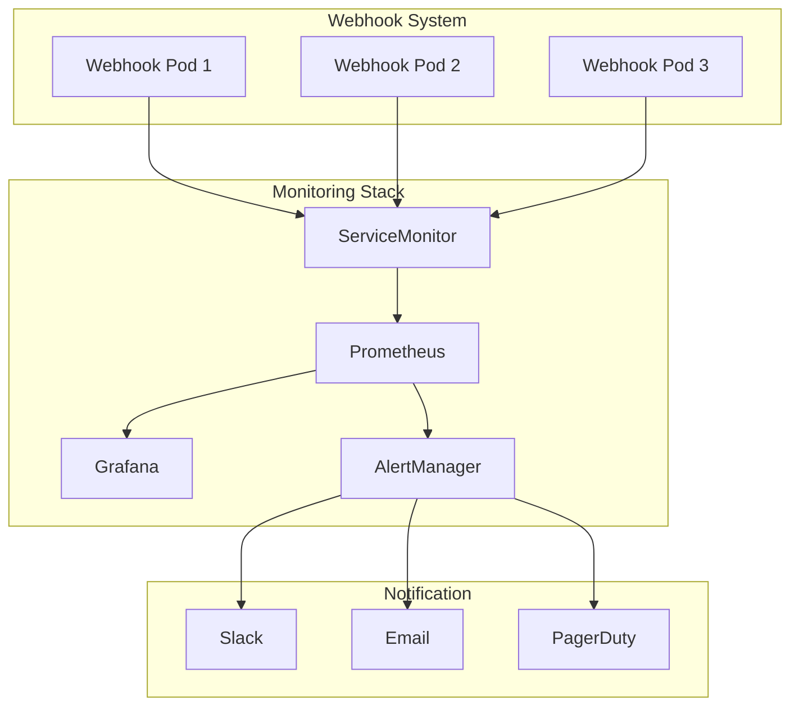

# 監視・アラート設定ガイド

## 概要

このドキュメントは、k8s-deployment-hpa-validatorの監視とアラート設定について説明します。Prometheus、Grafana、AlertManagerを使用した包括的な監視システムの構築方法を提供します。

## 監視アーキテクチャ



## メトリクス仕様

### 基本メトリクス

#### webhook_requests_total
- **説明**: webhookリクエストの総数
- **タイプ**: Counter
- **ラベル**:
  - `method`: HTTPメソッド（POST）
  - `status`: レスポンスステータス（success, error）
  - `resource_type`: リソースタイプ（Deployment, HorizontalPodAutoscaler）
  - `namespace`: 対象リソースの名前空間
  - `validation_result`: バリデーション結果（allowed, denied）

```promql
# 例: 1分間のリクエスト率
rate(webhook_requests_total[1m])

# 例: エラー率
rate(webhook_requests_total{status="error"}[5m]) / rate(webhook_requests_total[5m])
```

#### webhook_request_duration_seconds
- **説明**: webhookリクエストの処理時間
- **タイプ**: Histogram
- **ラベル**:
  - `method`: HTTPメソッド
  - `resource_type`: リソースタイプ
  - `namespace`: 対象リソースの名前空間

```promql
# 例: 95パーセンタイルの応答時間
histogram_quantile(0.95, rate(webhook_request_duration_seconds_bucket[5m]))

# 例: 平均応答時間
rate(webhook_request_duration_seconds_sum[5m]) / rate(webhook_request_duration_seconds_count[5m])
```

#### webhook_validation_errors_total
- **説明**: バリデーションエラーの総数
- **タイプ**: Counter
- **ラベル**:
  - `error_type`: エラータイプ（validation, configuration, network, certificate, internal）
  - `resource_type`: リソースタイプ
  - `namespace`: 対象リソースの名前空間

```promql
# 例: エラータイプ別の発生率
rate(webhook_validation_errors_total[5m])
```

#### webhook_certificate_expiry_seconds
- **説明**: TLS証明書の有効期限までの秒数
- **タイプ**: Gauge
- **ラベル**:
  - `certificate_name`: 証明書名

```promql
# 例: 証明書の有効期限（日数）
webhook_certificate_expiry_seconds / 86400
```

### システムメトリクス

#### go_memstats_alloc_bytes
- **説明**: 割り当てられたメモリ量
- **タイプ**: Gauge

#### go_goroutines
- **説明**: 実行中のGoroutine数
- **タイプ**: Gauge

#### process_cpu_seconds_total
- **説明**: CPU使用時間の累計
- **タイプ**: Counter

## Prometheus設定

### ServiceMonitor設定

```yaml
apiVersion: monitoring.coreos.com/v1
kind: ServiceMonitor
metadata:
  name: k8s-deployment-hpa-validator
  namespace: webhook-system
  labels:
    app: k8s-deployment-hpa-validator
spec:
  selector:
    matchLabels:
      app: k8s-deployment-hpa-validator
      component: metrics
  endpoints:
  - port: metrics
    interval: 30s
    path: /metrics
    scheme: http
    scrapeTimeout: 10s
  namespaceSelector:
    matchNames:
    - webhook-system
```

### PrometheusRule設定

```yaml
apiVersion: monitoring.coreos.com/v1
kind: PrometheusRule
metadata:
  name: k8s-deployment-hpa-validator-rules
  namespace: webhook-system
  labels:
    app: k8s-deployment-hpa-validator
spec:
  groups:
  - name: webhook.rules
    interval: 30s
    rules:
    # 記録ルール
    - record: webhook:request_rate
      expr: rate(webhook_requests_total[5m])
      
    - record: webhook:error_rate
      expr: rate(webhook_requests_total{status="error"}[5m]) / rate(webhook_requests_total[5m])
      
    - record: webhook:p95_latency
      expr: histogram_quantile(0.95, rate(webhook_request_duration_seconds_bucket[5m]))
      
    - record: webhook:p99_latency
      expr: histogram_quantile(0.99, rate(webhook_request_duration_seconds_bucket[5m]))
      
    # アラートルール
    - alert: WebhookDown
      expr: up{job="k8s-deployment-hpa-validator"} == 0
      for: 1m
      labels:
        severity: critical
        component: webhook
      annotations:
        summary: "Webhook is down"
        description: "k8s-deployment-hpa-validator webhook has been down for more than 1 minute."
        
    - alert: WebhookHighErrorRate
      expr: webhook:error_rate > 0.05
      for: 5m
      labels:
        severity: warning
        component: webhook
      annotations:
        summary: "High error rate detected"
        description: "Webhook error rate is {{ $value | humanizePercentage }} for more than 5 minutes."
        
    - alert: WebhookHighLatency
      expr: webhook:p95_latency > 1
      for: 5m
      labels:
        severity: warning
        component: webhook
      annotations:
        summary: "High latency detected"
        description: "Webhook 95th percentile latency is {{ $value }}s for more than 5 minutes."
        
    - alert: WebhookCertificateExpiringSoon
      expr: webhook_certificate_expiry_seconds / 86400 < 30
      for: 1h
      labels:
        severity: warning
        component: certificate
      annotations:
        summary: "Certificate expiring soon"
        description: "TLS certificate {{ $labels.certificate_name }} will expire in {{ $value }} days."
        
    - alert: WebhookCertificateExpired
      expr: webhook_certificate_expiry_seconds <= 0
      for: 1m
      labels:
        severity: critical
        component: certificate
      annotations:
        summary: "Certificate expired"
        description: "TLS certificate {{ $labels.certificate_name }} has expired."
        
    - alert: WebhookHighMemoryUsage
      expr: process_resident_memory_bytes{job="k8s-deployment-hpa-validator"} / 1024 / 1024 > 256
      for: 10m
      labels:
        severity: warning
        component: resource
      annotations:
        summary: "High memory usage"
        description: "Webhook memory usage is {{ $value }}MB for more than 10 minutes."
        
    - alert: WebhookTooManyGoroutines
      expr: go_goroutines{job="k8s-deployment-hpa-validator"} > 1000
      for: 10m
      labels:
        severity: warning
        component: resource
      annotations:
        summary: "Too many goroutines"
        description: "Webhook has {{ $value }} goroutines running for more than 10 minutes."
```

## Grafana ダッシュボード

### ダッシュボード設定

```json
{
  "dashboard": {
    "id": null,
    "title": "k8s-deployment-hpa-validator Dashboard",
    "tags": ["kubernetes", "webhook", "admission-controller"],
    "timezone": "browser",
    "panels": [
      {
        "id": 1,
        "title": "Request Rate",
        "type": "stat",
        "targets": [
          {
            "expr": "sum(rate(webhook_requests_total[5m]))",
            "legendFormat": "Requests/sec"
          }
        ],
        "fieldConfig": {
          "defaults": {
            "unit": "reqps"
          }
        }
      },
      {
        "id": 2,
        "title": "Error Rate",
        "type": "stat",
        "targets": [
          {
            "expr": "sum(rate(webhook_requests_total{status=\"error\"}[5m])) / sum(rate(webhook_requests_total[5m]))",
            "legendFormat": "Error Rate"
          }
        ],
        "fieldConfig": {
          "defaults": {
            "unit": "percentunit",
            "thresholds": {
              "steps": [
                {"color": "green", "value": 0},
                {"color": "yellow", "value": 0.01},
                {"color": "red", "value": 0.05}
              ]
            }
          }
        }
      },
      {
        "id": 3,
        "title": "Response Time",
        "type": "graph",
        "targets": [
          {
            "expr": "histogram_quantile(0.50, rate(webhook_request_duration_seconds_bucket[5m]))",
            "legendFormat": "50th percentile"
          },
          {
            "expr": "histogram_quantile(0.95, rate(webhook_request_duration_seconds_bucket[5m]))",
            "legendFormat": "95th percentile"
          },
          {
            "expr": "histogram_quantile(0.99, rate(webhook_request_duration_seconds_bucket[5m]))",
            "legendFormat": "99th percentile"
          }
        ],
        "yAxes": [
          {
            "unit": "s"
          }
        ]
      },
      {
        "id": 4,
        "title": "Request Volume by Resource Type",
        "type": "graph",
        "targets": [
          {
            "expr": "sum(rate(webhook_requests_total[5m])) by (resource_type)",
            "legendFormat": "{{ resource_type }}"
          }
        ]
      },
      {
        "id": 5,
        "title": "Validation Results",
        "type": "piechart",
        "targets": [
          {
            "expr": "sum(rate(webhook_requests_total[5m])) by (validation_result)",
            "legendFormat": "{{ validation_result }}"
          }
        ]
      },
      {
        "id": 6,
        "title": "Certificate Expiry",
        "type": "stat",
        "targets": [
          {
            "expr": "webhook_certificate_expiry_seconds / 86400",
            "legendFormat": "Days until expiry"
          }
        ],
        "fieldConfig": {
          "defaults": {
            "unit": "d",
            "thresholds": {
              "steps": [
                {"color": "red", "value": 0},
                {"color": "yellow", "value": 7},
                {"color": "green", "value": 30}
              ]
            }
          }
        }
      },
      {
        "id": 7,
        "title": "Memory Usage",
        "type": "graph",
        "targets": [
          {
            "expr": "process_resident_memory_bytes{job=\"k8s-deployment-hpa-validator\"} / 1024 / 1024",
            "legendFormat": "Memory Usage (MB)"
          }
        ]
      },
      {
        "id": 8,
        "title": "CPU Usage",
        "type": "graph",
        "targets": [
          {
            "expr": "rate(process_cpu_seconds_total{job=\"k8s-deployment-hpa-validator\"}[5m]) * 100",
            "legendFormat": "CPU Usage (%)"
          }
        ]
      },
      {
        "id": 9,
        "title": "Goroutines",
        "type": "graph",
        "targets": [
          {
            "expr": "go_goroutines{job=\"k8s-deployment-hpa-validator\"}",
            "legendFormat": "Goroutines"
          }
        ]
      },
      {
        "id": 10,
        "title": "Error Types",
        "type": "graph",
        "targets": [
          {
            "expr": "sum(rate(webhook_validation_errors_total[5m])) by (error_type)",
            "legendFormat": "{{ error_type }}"
          }
        ]
      }
    ],
    "time": {
      "from": "now-1h",
      "to": "now"
    },
    "refresh": "30s"
  }
}
```

### ダッシュボードのインポート方法

```bash
# Grafana CLIを使用してダッシュボードをインポート
grafana-cli dashboards import webhook-dashboard.json

# または、Grafana UIから手動でインポート
# 1. Grafana UIにログイン
# 2. "+" -> "Import" を選択
# 3. JSONファイルをアップロードまたは内容を貼り付け
```

## AlertManager設定

### AlertManager設定ファイル

```yaml
global:
  smtp_smarthost: 'smtp.example.com:587'
  smtp_from: 'alerts@example.com'
  smtp_auth_username: 'alerts@example.com'
  smtp_auth_password: 'password'

route:
  group_by: ['alertname', 'component']
  group_wait: 10s
  group_interval: 10s
  repeat_interval: 1h
  receiver: 'webhook-alerts'
  routes:
  - match:
      severity: critical
    receiver: 'critical-alerts'
  - match:
      component: certificate
    receiver: 'certificate-alerts'

receivers:
- name: 'webhook-alerts'
  slack_configs:
  - api_url: 'https://hooks.slack.com/services/YOUR/SLACK/WEBHOOK'
    channel: '#webhook-alerts'
    title: 'Webhook Alert'
    text: '{{ range .Alerts }}{{ .Annotations.summary }}: {{ .Annotations.description }}{{ end }}'

- name: 'critical-alerts'
  email_configs:
  - to: 'oncall@example.com'
    subject: 'CRITICAL: {{ .GroupLabels.alertname }}'
    body: |
      {{ range .Alerts }}
      Alert: {{ .Annotations.summary }}
      Description: {{ .Annotations.description }}
      Labels: {{ range .Labels.SortedPairs }}{{ .Name }}={{ .Value }} {{ end }}
      {{ end }}
  slack_configs:
  - api_url: 'https://hooks.slack.com/services/YOUR/SLACK/WEBHOOK'
    channel: '#critical-alerts'
    title: 'CRITICAL ALERT'
    text: '{{ range .Alerts }}{{ .Annotations.summary }}: {{ .Annotations.description }}{{ end }}'

- name: 'certificate-alerts'
  email_configs:
  - to: 'security@example.com'
    subject: 'Certificate Alert: {{ .GroupLabels.alertname }}'
    body: |
      {{ range .Alerts }}
      Certificate: {{ .Labels.certificate_name }}
      Alert: {{ .Annotations.summary }}
      Description: {{ .Annotations.description }}
      {{ end }}
```

## 監視のベストプラクティス

### 1. メトリクスの収集間隔

- **高頻度メトリクス** (15-30秒): リクエスト率、エラー率、レスポンス時間
- **中頻度メトリクス** (1-5分): リソース使用量、証明書有効期限
- **低頻度メトリクス** (5-15分): システム情報、設定情報

### 2. アラートの設定指針

#### 重要度レベル
- **Critical**: サービス停止、証明書期限切れ
- **Warning**: 高エラー率、高レスポンス時間、リソース不足
- **Info**: 設定変更、デプロイメント完了

#### アラート条件の設定
```yaml
# 良い例: 一時的なスパイクを避けるため適切な期間を設定
expr: webhook:error_rate > 0.05
for: 5m

# 悪い例: 期間が短すぎて誤報が多い
expr: webhook:error_rate > 0.05
for: 30s
```

### 3. ダッシュボードの構成

#### レイアウトの推奨構成
1. **概要セクション**: 全体的な健康状態
2. **パフォーマンスセクション**: レスポンス時間、スループット
3. **エラーセクション**: エラー率、エラータイプ
4. **リソースセクション**: CPU、メモリ、ネットワーク
5. **セキュリティセクション**: 証明書、認証

## 運用手順

### 日次監視チェックリスト

- [ ] ダッシュボードで全体的な健康状態を確認
- [ ] アクティブなアラートがないか確認
- [ ] エラー率が正常範囲内か確認
- [ ] レスポンス時間が許容範囲内か確認
- [ ] リソース使用量が適切か確認

### 週次監視チェックリスト

- [ ] 証明書の有効期限を確認
- [ ] ログの容量とローテーションを確認
- [ ] メトリクスの保存期間を確認
- [ ] アラート設定の見直し
- [ ] ダッシュボードの最適化

### 月次監視チェックリスト

- [ ] 監視システム自体の健康状態確認
- [ ] メトリクスの長期トレンド分析
- [ ] アラートの誤報率分析
- [ ] 監視設定の改善提案
- [ ] 災害復旧手順の確認

## トラブルシューティング

### メトリクスが取得できない場合

```bash
# ServiceMonitorの確認
kubectl get servicemonitor -n webhook-system

# Prometheusのターゲット確認
# Prometheus UI -> Status -> Targets

# メトリクスエンドポイントの直接確認
kubectl port-forward -n webhook-system svc/k8s-deployment-hpa-validator 8080:8080
curl http://localhost:8080/metrics
```

### アラートが発火しない場合

```bash
# PrometheusRuleの確認
kubectl get prometheusrule -n webhook-system

# Prometheusでのルール確認
# Prometheus UI -> Status -> Rules

# AlertManagerの確認
# AlertManager UI -> Status
```

### Grafanaダッシュボードが表示されない場合

```bash
# Grafanaのデータソース確認
# Grafana UI -> Configuration -> Data Sources

# Prometheusとの接続確認
# データソース設定でTest接続を実行
```

## 参考資料

- [Prometheus Monitoring Best Practices](https://prometheus.io/docs/practices/)
- [Grafana Dashboard Best Practices](https://grafana.com/docs/grafana/latest/best-practices/)
- [AlertManager Configuration](https://prometheus.io/docs/alerting/latest/configuration/)
- [Kubernetes Monitoring with Prometheus](https://prometheus.io/docs/guides/kubernetes-monitoring/)